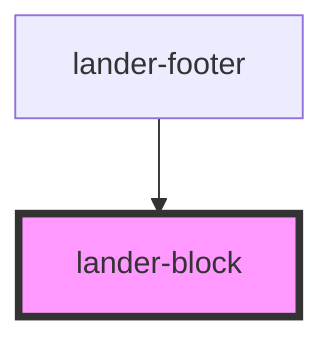

# lander-block

<!-- Auto Generated Below -->

## Properties

| Property          | Attribute         | Description | Type      | Default         |
| ----------------- | ----------------- | ----------- | --------- | --------------- |
| `backgroundcolor` | `backgroundcolor` |             | `string`  | `'transparent'` |
| `backgroundimage` | `backgroundimage` |             | `string`  | `undefined`     |
| `height`          | `height`          |             | `string`  | `'auto'`        |
| `hint`            | `hint`            |             | `string`  | `undefined`     |
| `narrow`          | `narrow`          |             | `boolean` | `undefined`     |

## Dependencies

### Used by

 - [lander-footer](../../molecules/lander-footer)

### Graph

----------------------------------------------

*Built with [StencilJS](https://stenciljs.com/)*
